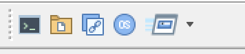
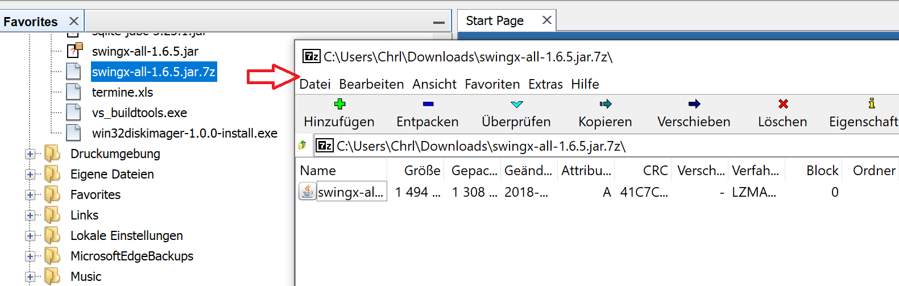

# QuickOpener-NetBeans

   

## Description

Sometimes while programming in NetBeans you want to explore a particular file that you are editing on the file system browser, or maybe launch a command in a terminal to do something with it.

This plugins brings to your NetBeans six action, three of them always available and three of them available when the selected node has a file assiociated with it. In particular:

_When the selection has a valid file:_

* **Open the default OS shell** on the location of the file (or its folder) selected.
&nbsp;
* **Open the file system browser** on the location of the file (or its folder) selected.
&nbsp;
* **Copy to the clipboard** the path of the file selected.
&nbsp;
* **Open in default OS app** File opens in default app from the OS, not in NetBeans.
&nbsp;

_Always enabled:_

* **Launch a shell command** (with parameters, customizable on preferences) &nbsp; 
* **FileSystem browser on any location** (favorites, customizable on preferences)
&nbsp; 
* **Open a shell on any location** (favorites, customizable on preferences)
&nbsp; 

## Changelog

See [Changelog](./Changelog.md) for all information

## NetBeans Compatibility

No official support anymore for NetBeans < 9.0  
Version >= 1.4.0 is compatible to Apache NetBeans >= 9.0  
[For NetBeans < NB8.1]: http://plugins.netbeans.org/plugin/43217/quickopener  
[For NetBeans, > NB8.1]: http://plugins.netbeans.org/plugin/62668/?show=true  

## Wiki

See the [Wiki]: https://github.com/dzsessona/QuickOpener-NetBeans/wiki for all tutorials.